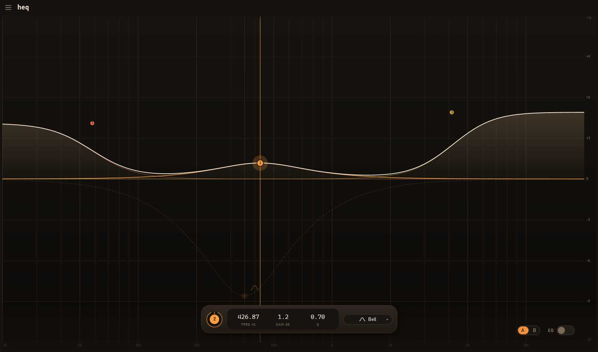

# heq

A modern equalizer interface for [EqualizerAPO](https://sourceforge.net/projects/equalizerapo/) built with C#

Including A/B switching functionality, automatic loudness adjustment for uniform preset loudness, grouping of presets, per channel adjustments for a group.


# Requirements
.NET 10 Runtime/SDK, Windows 10 1809+ or newer system with EqualizerAPO installed.

You can install EqualizerAPO from
https://sourceforge.net/projects/equalizerapo

# Build

```
dotnet build src/Heq/Heq.csproj
dotnet run   --project src/Heq/Heq.csproj
```

# License
Project is licensed under the MIT license
